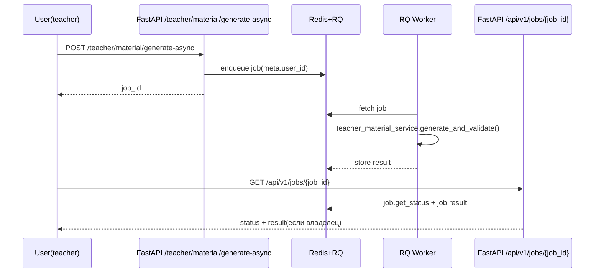

# OKU Architecture Evolution (Selective Extraction)

Цель документа: зафиксировать практичный подход “модульный монолит + selective extraction”, без бессмысленного распила на микросервисы.

## 1) Базовый принцип OKU на ближайшие итерации

Оставляем в модульном монолите (FastAPI + SQLAlchemy + Alembic + сервис-слой):
- domain-модели и invariants (RBAC, membership/институциональные связи),
- REST API contract,
- транзакционную бизнес-логику (создание/обновление тестов, результаты, модерация),
- orchestration быстрых операций.

Вынесем в отдельные процессы/воркеры (RQ + Redis) только там, где реально “тяжело” для HTTP:
- LLM-пайплайны с потенциально большим временем выполнения,
- операции парсинга/преобразования контента, если они начнут отъедать p95/p99 HTTP-латентность,
- async “длинные хвосты” с очередью и polling/статусом.

На текущем этапе мы придерживаемся этого принципа: **teacher material generation** ушла из синхронного HTTP в RQ.

## 2) Что конкретно уже вынесено (и почему это правильно)

### Teacher material generation -> RQ job

Синхронная версия была в:
- `backend/app/api/teacher.py` → `generate_custom_test_material()` → `teacher_material_service.generate_and_validate()`

Теперь асинхронная версия:
- `backend/app/api/teacher.py` → `POST /teacher/material/generate-async`
  - ставит RQ job через `backend/app/worker/queue.py::enqueue_task()`,
  - возвращает `job_id`,
  - polling выполняется через `GET /api/v1/jobs/{job_id}`.

RQ task:
- `backend/app/worker/tasks.py` → `generate_teacher_custom_material_task()`

Безопасность доступа:
- `backend/app/worker/queue.py` прокидывает `meta.user_id`,
- `backend/app/api/jobs.py` проверяет владельца job’а (`403`, если не совпадает).

Почему это “достаточно” на текущем масштабе:
- мы сняли главный источник долгих запросов без изменения domain-моделей и таблиц,
- сохранили REST API и единую точку контрактов,
- очереди/worker у нас уже есть в `docker-compose.yml`.

## 3) Storage: подготовка к object storage без ломки контракта

Проблема роста: бинарные изображения сейчас попадают в `image_data_url` (data URL base64) и кладутся в JSON поля Postgres.

Мы подготовили переход через ref-поля:
- `backend/app/services/material_storage.py` добавляет поле `image_material_ref` вместе с inline `image_data_url`,
- `backend/app/core/config.py` содержит `MATERIAL_STORAGE_MODE` (`db|object`).

Текущее поведение:
- контракт не ломаем: UI/серилизация продолжают использовать `image_data_url`,
- появляется референс для будущей миграции на S3-compatible.

## 4) Критерии “когда пора выносить”

Рекомендуем переводить домен/операцию в worker, если одновременно выполняются 2-3 условия:
- HTTP handler делает сетевые вызовы к LLM/внешним провайдерам,
- возможны retry/несколько батчей (например, `max_calls > 1`),
- операция превышает комфортный бюджет latency (условно p95 > 2-3 сек),
- есть выраженная потребность в статусе “queued/running/failed”,
- ошибка должна быть адресована асинхронно (а не как “мгновенная 502 на каждый запрос”).

Не стоит выносить в worker:
- чистые read-only запросы к БД,
- доменные транзакции с ясным runtime-ограничением,
- “обычную” валидацию/нормализацию данных, которая бы только усложнила мониторинг.

## 5) Что “следующим шагом” имеет смысл вынести

После teacher material generation вероятный кандидат:
- semantic grading/recommendation synthesis для student flow,
  если latency/стоимость LLM начнет влиять на user experience.

Но этот шаг стоит делать только после метрик:
- p95/p99 по тем ручкам,
- процент LLM-ветвлений,
- глубина очереди и среднее время обработки RQ jobs.

## 6) Мини-диаграмма текущего async потока

